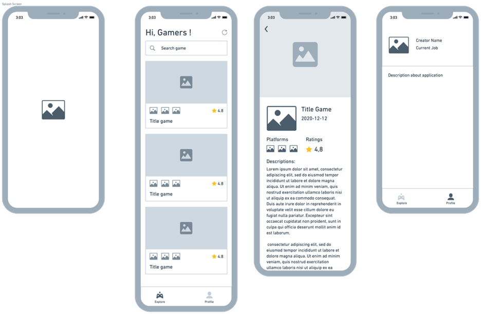

# game-info

Aplikasi GameInfo merupakan aplikasi catalog game yang di rancang khusus untuk keperluan submission awal pada modul Belajar Fundamental Aplikasi IOS. Dalam membangun aplikasi ini terdapat beberapa halaman diantaranya adalah:

| No | Page Name                    | Fungsi                                                            |
| -- | -----------------------------| ------------------------------------------------------------------|
| 1  | Home                         | berfungsi untuk menampilkan catalog game                          |
| 2  | Detail                       | menampilkan detail informasi dari catalog game yang di pilih      |
| 3  | Profile                      | menjelaskan tentang aplikasi dan profile pembuat                  |

berikut merupakan sketsa atau wireframe dari aplikasi PremierLeagueInfo:

### Penjelasan Singkat
1. ketika user pertama kali masuk ke halaman utama atau home maka akan muncul loading terlebih dahulu yg mana proses ini membutuhkan waktu untuk mengambil data ke API https://rawg.io
2. apabila berhasil maka daftar games akan muncul di halaman home tersebut
3. jika user melakukan scroll ke bawah maka akan di temukan loading yg mana pada proses ini akan melakukan request ke api untuk menampilkan 10 list game berikutnya
4. user bisa melakukan pencarian dengan cara memasukan keywoards atau kata kunci di kolom pencarian
5. ketika user memilih salah satu game dari list maka akan di lanjutkan ke halaman detail game yang mana di halaman ini menampilkan deskripsi, gambar, rating, dan platforms yang support dari game tersebut
7. user dapat kembali ke halaman utama dengan menekan tombol navigasi back di pojok kanan atas
8. pilih "icon person" atau tab "about" maka user dapat melihat deskripsi dan pembuat dari aplikasi Game Info ini
